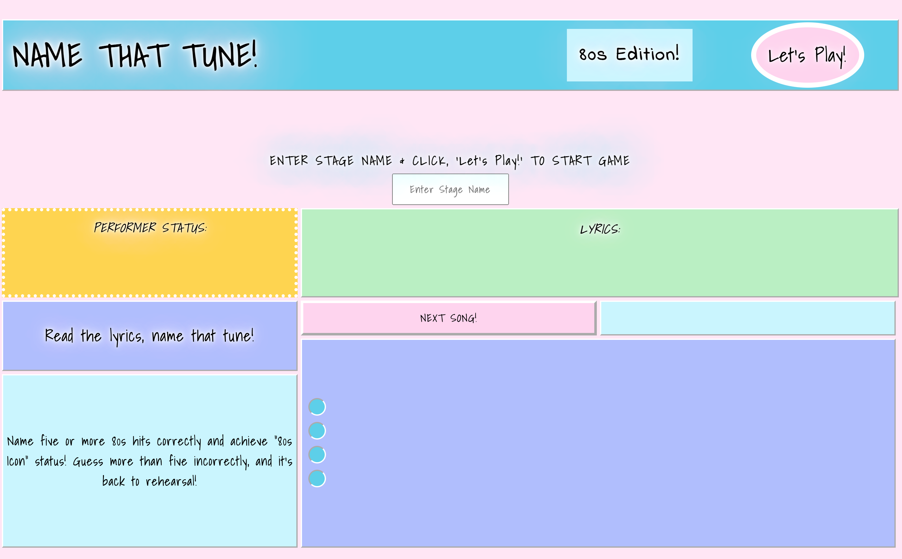

# **NAME THAT TUNE!**

## Inspiration

## Rules and General Overview

"Name That Tune" is a single-player quiz game. The goal of the game is to correctly name as many songs as you can after listening to part of the recording and reading a snippet of the lyrics. 

When the player begins the game, they are directed to enter their "stage name" and click the "Let's play!" button. Once they enter their stage name, that name along with a running total of correct and incorrect guesses is displayed at the top of the page. Once the player clicks the "Let's Play!" button, a recording starts playing. The recordings are played and lyrics displayed, in a randomized order with pre-determined correct and incorrect answers. The player then chooses an answer by clicking the corresponding button, which disables all other buttons. The player has only one chance to choose each round, and each recording snippet is played for 20 - 40 seconds. 

To win the game, the player must correctly guess six or more songs. If the player incorrectly guesses more than five or more songs, they lose.

## Special Conditions

The player achieves a certain "performer status" depending on how many songs are correctly guessed. See below:

- If the player correctly guesses less than or equal to 3 songs, they lose the game and achieve "80s Garageband" status.

- If the player correctly guesses more than 3 but less than or equal to 5 songs correctly, they lose the game and achieve, "80s Rising Star" status. 

- If the player correctly guesses more than or equal to 6 songs correctly, they win the game and achieve, "80s Icon" status. 

- If the player guesses correctly a message with a running total of correct guesses appears, and adds subsequent incorrect guesses.

- If the player guesses incorrectly a message with a running total of incorrect guesses appears, and adds subsequent incorrect guesses.

## Screenshots

## Technologies Used

- HTML
- CSS
- JavaScript

## Play the Game

[here](https://nicbrou.github.io/Name-That-Tune/). 

## Future Work

- Add a functionality to give the option to choose different eras of music. 